# {{ page.title | replace_first:'L','Lesson '}}
{: .no_toc }

## Table of Contents
{: .no_toc .text-delta }

1. TOC
{:toc}
---

In Lesson 8, we move beyond working with internal sensors on the CPX (light 💡, microphone 🔊, accelerometer 🍎) and show how to connect external sensors using **analog input**.

## Lesson 8.1: Overview of Analog Input

In this lesson, we introduce **analog input** on the Circuit Playground Express (CPX) primarily focusing on variable resistive sensors like rotary potentiometers, slide potentiometers, force-sensitive resistors (FSRs), flex sensors (Nintendo Power Glove!), softpot position sensors, and more!

  <iframe width="100%" src="https://www.youtube.com/embed/S6X4Y5gfekc?si=RysXDQ5unRU7n79H" title="YouTube video player" frameborder="0" allow="accelerometer; autoplay; clipboard-write; encrypted-media; gyroscope; picture-in-picture; web-share" allowfullscreen></iframe>

### Lesson 8.1 Code

- [Graphing Analog Input](https://makecode.com/_TbV5Tx22rdTh). Graphs the A1 value between 0-1023 in console and uses onboard NeoPixels as a graph

- [Analog Y Mouse Controller](https://makecode.com/_6HK2ucd74Aox). Controls mouse Y movement with A1 movement

## Lesson 8.2: What is Analog Input?

In this lesson, we learn more about *what* is **analog input** and *how* to use it on the CPX. We begin by introducing the 3.3V, GND, and A1 CPX connection pads and show how the function **[analog read](https://makecode.adafruit.com/learnsystem/pins-tutorial/analog-input/read-analog)** responds to different voltages (*e.g.,* 3.3V, GND). We then introduce the concept of dividing voltages via fixed resistors before building a lo-fi slide potentiometer using paper and a 2B pencil, which divides voltage dynamically.

  <iframe width="100%" src="https://www.youtube.com/embed/jX9gMRW-D1c?si=Ejqh4Oo25gVSDn8t" title="YouTube video player" frameborder="0" allow="accelerometer; autoplay; clipboard-write; encrypted-media; gyroscope; picture-in-picture; web-share" allowfullscreen></iframe>

### Circuit Diagrams

We use the following circuit diagrams in the [above video](https://youtu.be/jX9gMRW-D1c?si=AU5wpHec3SxNZqUP).

Begin by connecting a red alligator clip wire to 3.3V, a black wire to GND (0V), and a yellow wire to A1. While it's not necessary to follow these color-coded conventions, I **strongly** encourage you to always reserve **red** for connecting to your voltage source (in this case, 3.3V) and black for for **GND**. This will make it easier to debug your circuits.

{: .warning }
Never touch the black wire (GND) to the red wire (3.3V) directly. If you do this, you *could* harm the CPX or your USB connection on your laptop. In practice, I've found that the CPX has internal protection circuitry that resets your board on a short (and your laptop may also observe that an amperage draw is too high and disconnect).

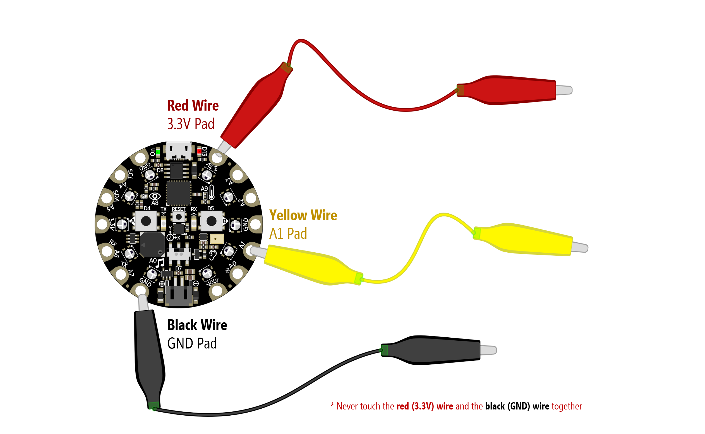

Now, with [this program](https://makecode.com/_TbV5Tx22rdTh) running on the CPX, open up your "Device Console" and observe the waveform. Try touching the yellow wire to the red wire. You should see the graph jump to 1023 (the max value).

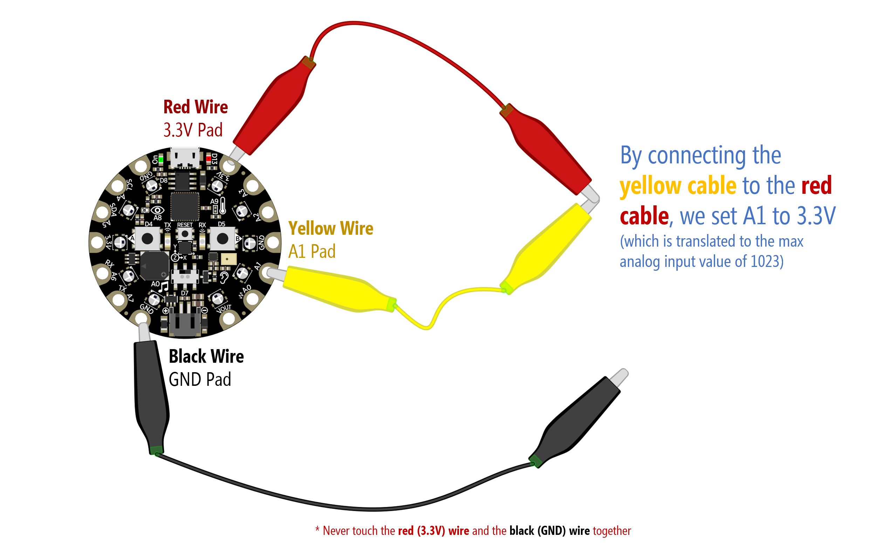

Now try touching the yellow wire to black. What happens? You should see the graph jump down to 0 (the min value).

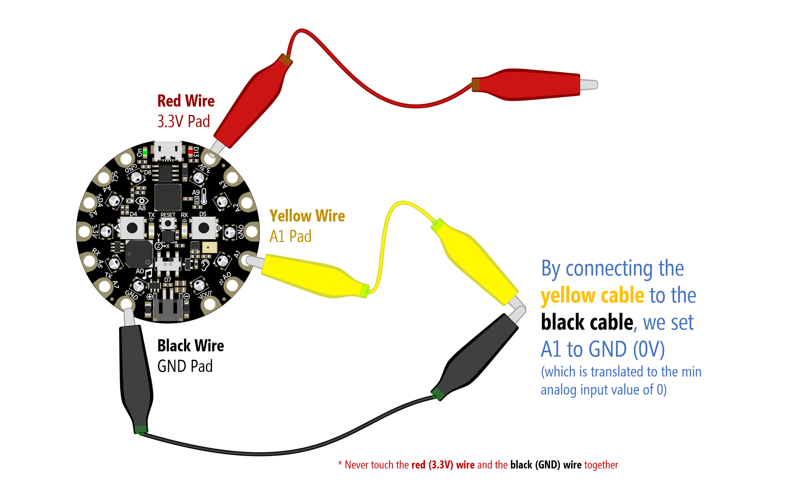

### Optional Theory

{: .note }
It's OK if you don't understand exactly how voltage dividers work. The key is in developing a bit of intuition about how the CPX analog read function works and what physical phenomena it is reading on A1 (it's voltage!). Any sensor that can manipulate voltage can be used as input. If you want to learn more about potentiometers and voltage dividers, see our [Arduino L4: Potentiometer lesson](../arduino/potentiometers.md) and [Electronics L4: Voltage Dividers lesson](../electronics/series-parallel.md#voltage-dividers)

In the above examples, we showed how to read 3.3V and GND (0V) with the CPX by touching the yellow wire to the red and black respectively and graphing the result. But analog input is far more interesting than just two numbers: 0 and 1023. How can we play with everything in between?

We can do this by dividing the input voltage using resistors, which we cover in great detail in our [Electronics L4: Voltage Divider lesson](series-parallel.md#voltage-dividers) and touch on it a bit in the above video. We need not repeat ourselves here; however, if you want to experiment with manually controlling different input voltages on A1, try adding different resistor combinations like the following.

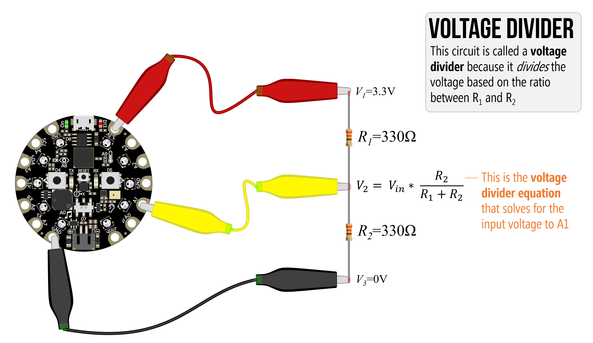

The key is not the raw resistor values themselves but rather the ratio between them. With equal resistors—in this case 330Ω—the 3.3V will be divided equally to 1.65V (and converted to 512 by the CPX).

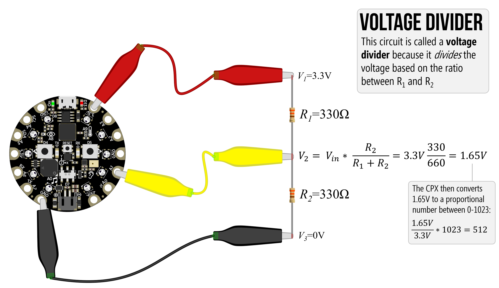

Similarly, if we add a pair of 470 resistors, the 3.3V will again be divided equally to 1.65V (and again converted to 512 by the CPX)

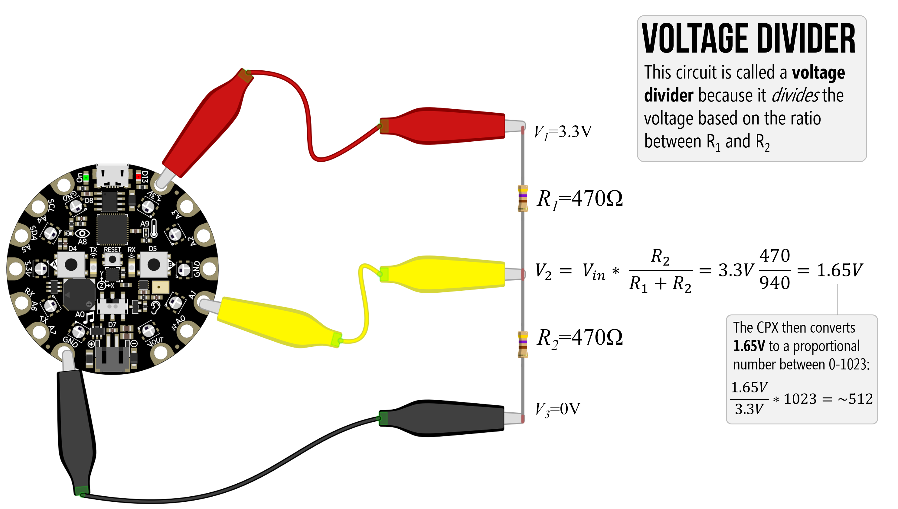

But if we change that ratio, we can get different input voltages on A1.

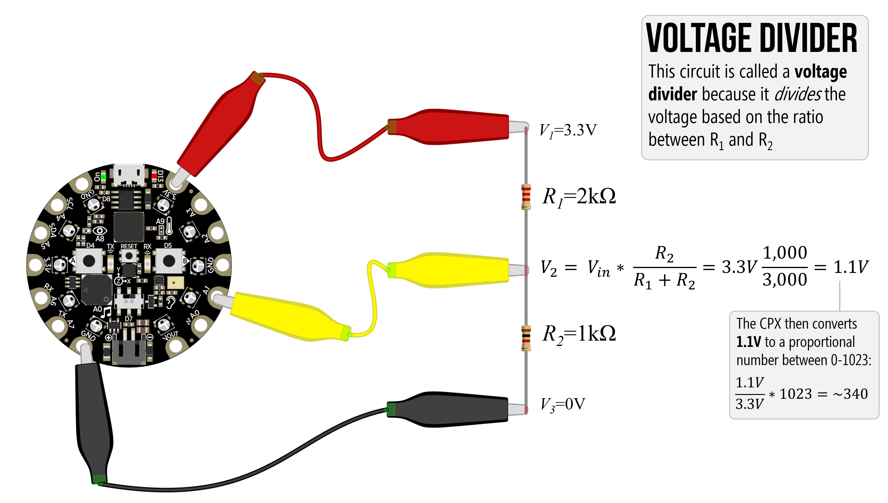

<!-- Well, the answer is: sensors vary their output voltages to convey data to microcontrollers. One common class of sensors is called "resistive sensors" such as potentiometers, pressure sensors, thermistors, and more, which vary their resistance based on some human or environmental interaction. -->

## Lesson 8.3: Hooking up Resistive Sensors

In this lesson, we learn how to hook up **three-legged variable resistors** like rotary and slide potentiometers as well as **two-legged variable resistors** like force-sensitive resistors, photosensitive resistors, and flex sensors.

  <iframe width="100%" src="https://www.youtube.com/embed/7aujdrvN55w?si=ub-BLhdQSCc1gnSn" title="YouTube video player" frameborder="0" allow="accelerometer; autoplay; clipboard-write; encrypted-media; gyroscope; picture-in-picture; web-share" allowfullscreen></iframe>

### Resistive Sensor Circuit Diagrams

Below, we provide circuit diagrams covered in the video. You can right-click and open up each image in a new tab to enlarge.

You can test any of these circuits using [this basic MakeCode](https://makecode.com/_TbV5Tx22rdTh), which simply graphs the output on A1 and lights up the corresponding NeoPixels (like a circular bargraph).

#### Rotary Potentiometer

Hooking up a rotary potentiometer

Hooking up two rotary potentiometers:

#### Slide Potentiometer

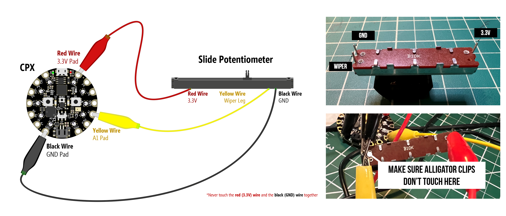

#### Pressure Sensor

You might be compelled to hook up your two-legged resistive sensors like pressure sensors, flex sensors, photosensitive resistors like this... but don't do this! It's wrong!

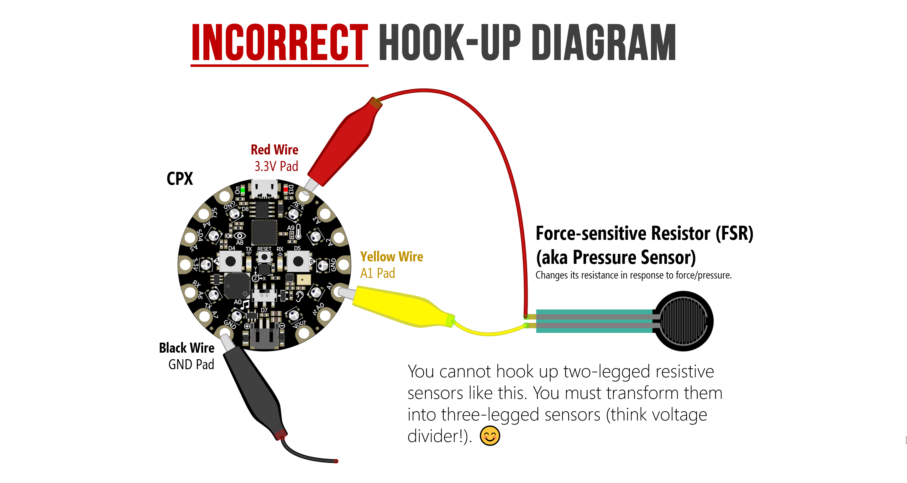

Instead, you need to add in an additional resistor to turn the circuit into a voltage divider where one of the resistors is your sensor, which dynamically changes its resistance.

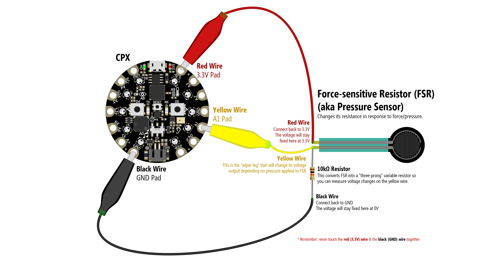

#### Photosensitive Resistor

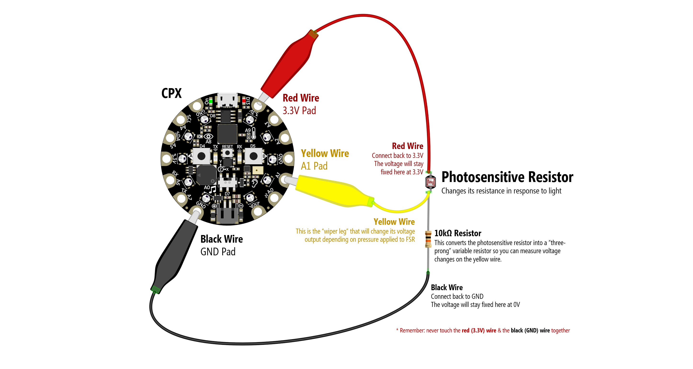

#### Flex Sensor

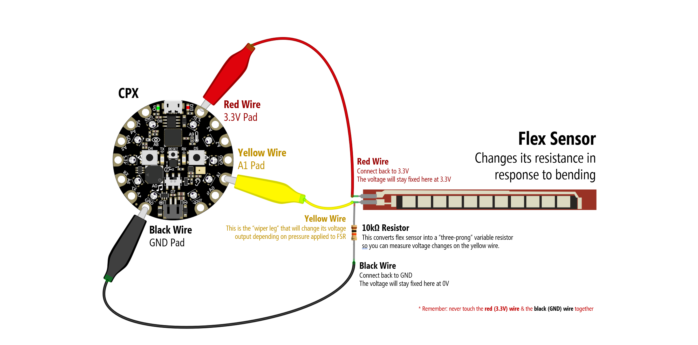

### Code

- [Analog X+Y Mouse](https://makecode.com/_CLJ8U8F2d7sT). Converts analog input on A1 and A2 to x,y mouse movement.

## Advanced Code

Here is some more advanced code:

* [Smoothing **A1** input using a **sliding window average** filter](https://makecode.com/_709gwz1vrLhC
)

* [Smoothing **A1** & **A2** input using a **sliding window average** filter](https://makecode.com/_asMfH6UqREW3)

<!-- OTHER LESSON IDEAS:
8.4: Resistive sensors -> analog mouse
8.5: Two resistive sensors -> analog mouse xy
8.6: Show how to use joystick (like two resistive sensors)

9.1 Digital input, etc.

Series 10 could be getting sensor data into computer (the hacky way)
 -->

## Next Lesson

In the next lesson, we'll learn how to use **digital input** like buttons!

[Previous: CPX as a Mouse](cpx-mouse.md){: .btn .btn-outline }
[Next: Digital Input](digital-input.md){: .btn .btn-outline }
