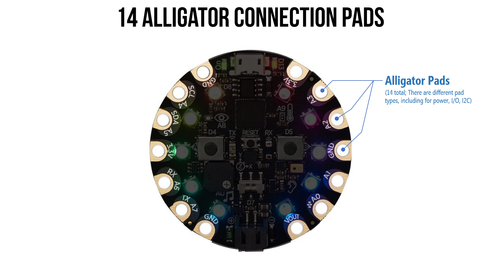
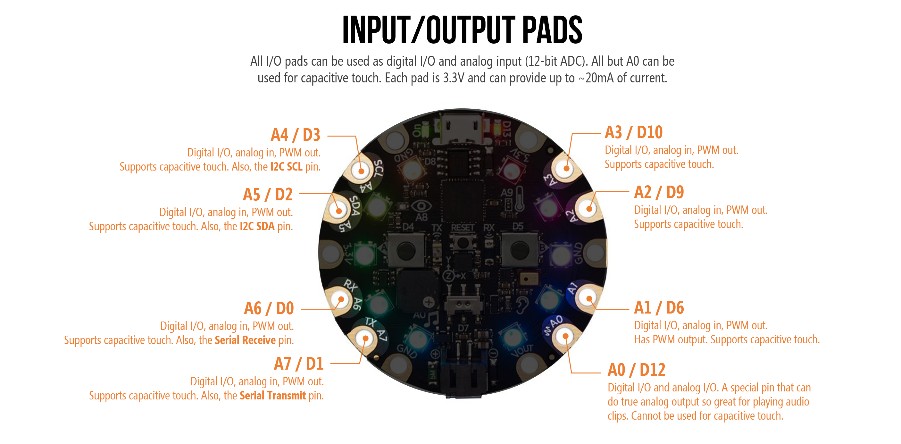

# {{ page.title | replace_first:'L','Lesson '}}
{: .no_toc }

## Table of Contents
{: .no_toc .text-delta }

1. TOC
{:toc}
---

**Figure.** The Circuit Express Playground. Image from [Adafruit](https://www.adafruit.com/product/3333). 
{: .fs-1 } 

The Circuit Playground Express (CPX) is an introductory physical computing board created by [Adafruit](https://adafruit.com). It is a wonderful electronic prototyping platform board for learning *electronics* and *programming* and for creating imaginative physical computing projects (*e.g.,* [see samples here](https://learn.adafruit.com/category/circuit-playground)).

Compared with [Arduino](../arduino/index.md), the CPX's advantages for novice makers are twofold:

1. First, the CPX can be programmed with an **easy-to-use drag-and-drop visual programming language** called [MakeCode](https://makecode.adafruit.com/) developed by [Microsoft](https://www.microsoft.com/en-us/makecode), which is similar to [Scratch](https://scratch.mit.edu/). As students and makers gain experience and expertise, they can switch over to more advanced programming languages such as [CircuitPython](https://learn.adafruit.com/adafruit-circuit-playground-express/what-is-circuitpython) (Python), or [Arduino](https://learn.adafruit.com/adafruit-circuit-playground-express/arduino) (C/C++)

2. Second, the CPX includes a variety of **built-in inputs and outputs**, so you do not need to purchase or wire-up external components (or even use a [breadboard](../electronics/breadboards.md)). On-board **inputs** include a [LIS3DH accelerometer](https://learn.adafruit.com/adafruit-lis3dh-triple-axis-accelerometer-breakout), a light-level sensor (a phototransistor), multiple push buttons, a microphone, and **outputs** include [neopixel LEDS](https://learn.adafruit.com/neopixels-with-makecode), a speaker, and infrared receivers/transmitters.

To contextualize CPX's potential even further, we can use the three evaluation criteria for creative construction kits that Mitchell Resnick and Brian Silverman outline in their fantastic IDC'05 paper ["Some Reflections on Designing Construction Kits for Kids"](https://doi.org/10.1145/1109540.1109556). Creative constructions kits should have:

1. **Low floors**—kits should be approachable, easy-to-use for beginners;
2. **high ceilings**—kits should grow with you as you learn and gain experience, allowing you to create  increasingly advanced projects; 
3. and **wide walls**—kits should support a breadth of designs and projects. 

We believe the CPX meets each of these criteria—making it a powerful prototyping and educational platform. As an example, at the University of Washington, the CPX has been used in our [MHCI+D program](https://mhcid.washington.edu/) as well as some introductory electrical engineering courses—quite the range of contexts!

## Hardware
<!-- 
**Figure.** An overview of the Circuit Express Playground (CPX) hardware including built-in input and output. See below for larger versions.
{: .fs-1 }  -->

<!-- 

*Figure.* An annotated version of the CPX showing the location of all main components. Image from [Adafruit](https://learn.adafruit.com/adafruit-circuit-playground-express/guided-tour).  -->

One key benefit of the CPX hardware—compared with vanilla Arduino boards like the Uno—is that it's  full of amazing input/output (IO) components. Adafruit provides a detailed ["guided tour"](https://learn.adafruit.com/adafruit-circuit-playground-express/guided-tour) but, in short, the board includes five types of input include motion, temperature, light, sound, and buttons as well as two types of output (LEDs, sound).

{: .note } It's OK if you don't understand all of the terminology used below. In fact, if this is the first time you've ever played with electronics, we fully expect that this is mostly all new to you. Still, it's worthwhile to skim over the sections below to get a sense of what's possible with the CPX before we start building!

### Built-in Input

Specifically, the CPX includes the following built-in input/sensors:

- 1 x Motion sensor (LIS3DH triple-axis accelerometer with tap detection, free-fall detection)
- 1 x Temperature sensor (thermistor)
- 1 x Light sensor (phototransistor). Can also act as a color sensor and pulse sensor.
- 1 x Sound sensor (MEMS microphone)
- 2 x Push buttons, labeled A and B
- 1 x Slide switch

**Figure.** An annotated image of the CPX's built-in sensors/input.
{: .fs-1 .align-center}

### Built-in Output

In addition to the built-in input, the CPX also has built-in LEDs and speaker for light and sound output. More specifically:

- 10 x mini [NeoPixels](https://learn.adafruit.com/neopixels-with-makecode), each one can display any color
- 1 x Mini speaker with class D amplifier (7.5mm magnetic speaker/buzzer)
- Green "ON" LED so you know its powered
- Red "#13" LED for basic blinking

**Figure.** An annotated image of the CPX's built-in output.
{: .fs-1 .align-center}

<!-- ### I/O

- Infrared (IR) receiver and transmitter: can receive and transmit any remote control codes, as well as send messages between Circuit Playground Expresses. Can also act as a proximity sensor.
- 8 x alligator-clip friendly input/output pins
- Includes I2C, UART, 8 pins that can do analog inputs, multiple PWM output -->

## Input/Output (I/O)

In addition to the built-in components, the CPX has 14 connection pads to support interfacing with external input/output (I/O), including buttons, LEDs, and more. You can use a variety of connection strategies from sewing with conductive thread to wire wrapping to even small metal screws, the most common connection is an alligator clip. 

TODO: insert picture or animated movie of CPX with alligator clips

<!--  -->

**Figure.** An annotated image of the CPX's 14 alligator pads for power and GPIO.
{: .fs-1 .align-center}

### Input/Output (I/O) Pads

The CPX has eight general purpose I/O pins (GPIO) for interfacing with external electronic components. All of the I/O pads can be used as digital I/O, analog input (12-bit ADC), and PWM. All but A0 can be used for capacitive touch (A0 is special and the only true analog output).

{: .warning }
Each pad can provide up to ~20mA of current so do not connect a motor or other high-power component directly. If you don't know what this means, that's OK! You can always ask the instruction team whether a component is safe to use!

TODO: consider adding brief .mp4 showing pressure sensor + CPX lights and a second .mp4 showing NeoPixel hookup.

For more information, see [Adafruit's CPX Pinouts Guide](https://learn.adafruit.com/adafruit-circuit-playground-express/pinouts#each-pin-2906289).

### Power Pads

As the [Adafruit CPX guide describes](https://learn.adafruit.com/adafruit-circuit-playground-express/pinouts#power-pads-2906283), there are six power pads equally spaced around the CPX's perimeter. Specifically, there are:

* 3 x **GND** pads, which are all connected together
* 2 x **3.3V out** pads
* 1 x **USB/battery Vout** pad, which is a special power pad. This pin will supply either USB power (5V) or LiPoly power (3.7V). If both are connected, the CPX supplies the higher voltage. This output is not connected to the onboard regulator, so can supply up to 500mA continuous and 1A peak before tripping the internal fuse (if the fuse trips, just wait a minute and it will automatically reset)

**Figure.** An annotated image of the CPX's GND and Vout power pads.
{: .fs-1 .align-center}

### CPX Microcontroller

The CPX also has a powerful embedded microcontroller—the ATSAMD21 ARM Cortex M0 Processor—running at 3.3V and 48MHz. In comparison, the Arduino Uno is powered by a much older and slower microcontroller: the ATmega328P at 5V and 16 MHz.

## Using the CPX as Computer Input

Like the Arduino Leonardo, the CPX can act like a keyboard, mouse, joystick, MIDI, or simply a serial port. So you can easily make custom input to your computer—neat!

## Programming

An additional benefit of the CPX compared with traditional Arduino is that it can be programmed multiple ways—for novices with limited programming background or for those who simply like visual programming languages, you can use [MakeCode](https://learn.adafruit.com/adafruit-circuit-playground-express/makecode). More advanced users may choose Python via [CircuitPython](https://learn.adafruit.com/adafruit-circuit-playground-express/what-is-circuitpython) or C/C++ via the [Arduino IDE](https://learn.adafruit.com/adafruit-circuit-playground-express/arduino).

### MakeCode

Microsoft's MakeCode was designed to provide a visual, drag-and-drop interface for programming physical computing projects. This visual programming style—called block-based programming—was popularized by and is similar to [Scratch](https://scratch.mit.edu/). The animation below shows how you program the CPX simply by dragging-and-dropping "puzzle pieces" (blocks).

<video class="img img-responsive lazy" preload="auto" muted="muted" loop="loop" autoplay="autoplay" playsinline="" poster="https://cdn-learn.adafruit.com/assets/assets/000/048/088/medium800thumb/makecodedragdemo.jpg?1510260958">
    <source src="https://cdn-learn.adafruit.com/assets/assets/000/048/088/large1024mp4/makecodedragdemo.mp4?1510260958">
    <source src="https://cdn-learn.adafruit.com/assets/assets/000/048/088/large1024webm/makecodedragdemo.webm?1510260958" type="video/webm; codecs=vp8,vorbis">
    <source src="https://cdn-learn.adafruit.com/assets/assets/000/048/088/large1024ogv/makecodedragdemo.ogv?1510260958" type="video/ogg; codecs=theora,vorbis">
    Your browser does not support the video tag.
</video>
**Video.** An animation showing how to program the CPX in MakeCode. Animation from [Adafruit](https://learn.adafruit.com/adafruit-circuit-playground-express/what-is-makecode).
{: .fs-1 }

Amazingly, you can also test your program and see how it behaves with a "virtual" CPX directly in MakeCode.

## Learning Resources

<!-- 
**Figure** A screenshot of the [Adafruit MakeCode website](https://makecode.adafruit.com/) that has links to tutorials and example projects.
{: .fs-1 } -->

To learn more, Adafruit and MakeCode have published a series of thoughtful, easy-to-understand tutorials:
- A ["What is MakeCode and How to Use it"](https://learn.adafruit.com/makecode) primer

- You can find [step-by-step MakeCode + CPX tutorials](https://makecode.adafruit.com/) within the MakeCode editor itself. The nice thing here is that the MakeCode editor walks you through each step. Pretty awesome!

- You can also access the above tutorials as [traditional, linear step-by-step guides here](https://makecode.adafruit.com/tutorials).

- Microsoft's [Peli de Halleux](https://learn.adafruit.com/users/pelikhan) has created a few CPX+MakeCode guides on the Adafruit website, including one on [NeoPixels](https://learn.adafruit.com/neopixels-with-makecode) and the other on [CPX Sensors](https://learn.adafruit.com/sensors-in-makecode).

- Adafruit also publishes individual "courses", including [Using the CPX Pins](https://makecode.adafruit.com/learnsystem/pins-tutorial), [Logic Lab](https://makecode.adafruit.com/learnsystem/logic-lab), and a [Maker Course](https://makecode.adafruit.com/courses/maker).

- Finally, if you want to dive deeper into some of the CPX's individual hardware components, [Shawn Hymel](https://shawnhymel.com/), Adafruit, and MakeCode teamed up to make a video-based tutorial series called [Behind the MakeCode Hardware](https://makecode.adafruit.com/behind-the-makecode-hardware), including topics on:
  - [Neopixels](https://youtu.be/Bo0cM2qmuAE). See also Halleux's [NeoPixels with MakeCode](https://learn.adafruit.com/neopixels-with-makecode) tutorial.
  - [Speaker](https://youtu.be/JjJ-KGwKh_4). See also the [Make it Sound](https://learn.adafruit.com/make-it-sound?view=all#music-and-sound-in-makecode) tutorial.
  - [Accelerometer](https://youtu.be/2HzNKz-QlV0)
  - [Light Sensor](https://youtu.be/9LrWQ68lO20)
  - [Infrared](https://youtu.be/0EMuaMClfos)
  - [Microphone](https://youtu.be/g5894PVYOF4)

### Example projects

- Adafruit publishes [example MakeCode+CPX example projects](https://learn.adafruit.com/category/makecode) along with tutorials.

## Next Lesson

In the [next lesson](makecode.md), we will make our first MakeCode+CPX program—called Blinky. As we build, we will learn about the MakeCode programming environment, the simulator, and how to load our program on to the CPX.

[Next: Programming the CPX with MakeCode](makecode.md){: .btn .btn-outline }

## Educational reflections

As someone who has worked with and taught physical computing for nearly a decade, MakeCode addresses several barriers to entry for novices (in rough order of importance):

- First, the block-based, drag-and-drop interface is far more accessible to novice programmers than Arduino's IDE and C/C++ environment. And MakeCode generates **real** JavaScript code based on your block program so you can go back and forth between the two.
- Second, **event handling**. A key challenge with Arduino for novices is handling events (e.g., when a button is pressed, do this), especially when programs contain lots of loops (which can make the system seem unresponsive, see this [discussion](https://makeabilitylab.github.io/physcomp/arduino/led-fade.html#improved-fading-approach-limiting-delays))
- Third, there is a built-in **simulation environment** that immediately lets you see how your code will perform before uploading it to your physical CPX device
- Finally, it is a **web-based editor**. There is nothing to install and you can program the CPX from your web browser. And once you've loaded the editor, it stays cached in your browser (so works offline).
